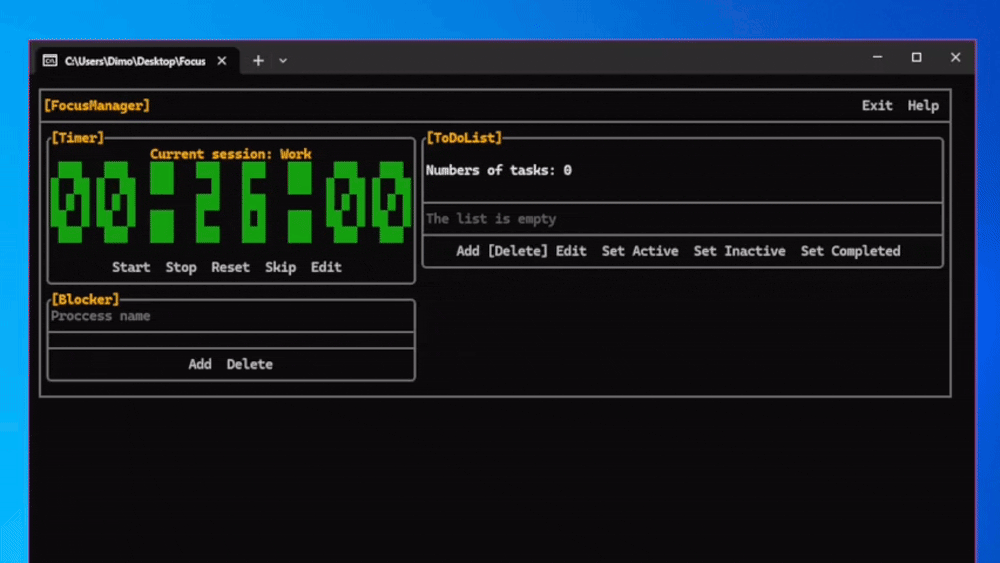

# FocusManager

A programme for staying focused on tasks

## How it works

<b>Details</b>

  
* **All buttons are clickable**
* **The fields for entering the date and time do not check that the date, time or their order are correct**
* **Data will only be saved after clicking the [Exit] button**
* **In Blocker, always enter the programme extension**
  

## Requirement

* Windows 10/11
* It is recommended that you use Windows Terminal, but you can also use the console

## Installation

1. Go to the **Releases** tab on the repository page.

2. Open the latest version of FocusManager.

3. In the **Assets** section, download the file with the `.exe` extension — for example, `FocusManager-Setup-1.1.0.exe`.

4. Once downloaded, run the installer.

5. If Windows Defender SmartScreen displays a warning about an unknown application:
   - click **‘More details’**;
   - then click **‘Run anyway’**.

   This warning appears because the application does not have a digital signature issued by a recognised publisher.

6. If Windows asks for permission to make changes to your computer, click **‘Yes’**.

7. In the Inno Setup installer:
   - select the required options;
   - click **Install**;
   - wait for the installation to complete.

8. Once the installation is complete, click **Finish**. If the relevant option was selected, FocusManager will launch automatically.

After installation, FocusManager can also be launched via the **Start** menu or the shortcut created on the desktop.

## License
[MIT LICENSE](LICENSE.txt)
